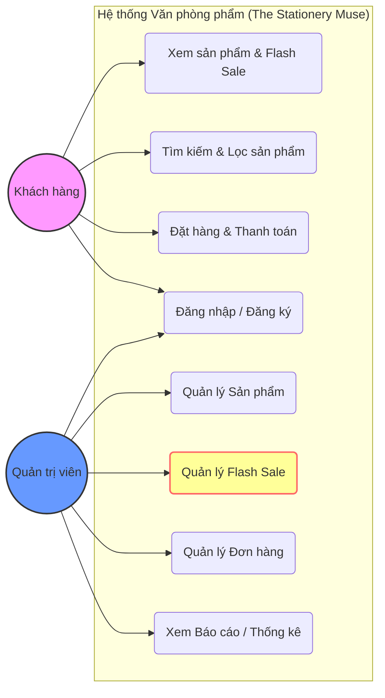
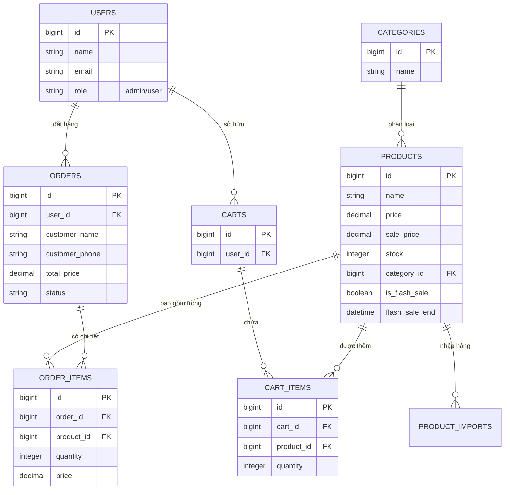
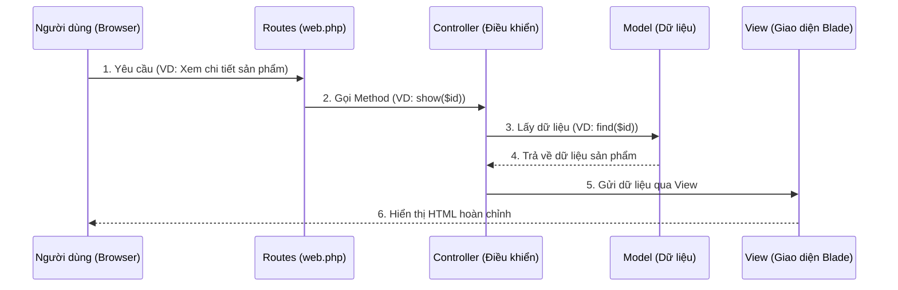

# Kiến trúc Hệ thống & Tài liệu Dữ liệu (Project Documentation)

Tài liệu này cung cấp cái nhìn tổng quan về kiến trúc phần mềm, các mô hình dữ liệu (Models) và mối liên kết giữa chúng trong dự án Hệ thống Quản lý Văn phòng phẩm (The 2026 Stationery Muse).

## 1. Công nghệ Sử dụng (Tech Stack)
*   **Backend**: Laravel Framework (Phiên bản 9.x)
*   **Database**: MySQL
*   **Frontend**: Tailwind CSS (Styling), Alpine.js (Tính tương tác mượt mà)
*   **Thiết kế**: Chủ đạo tông màu Beige - Sepia cao cấp, tối giản.

---

## 2. Mô hình Dữ liệu & Mối liên kết (Entity-Relationship)

Hệ thống được xây dựng dựa trên các mô hình chính sau đây:

### Sơ đồ Use Case (Chức năng hệ thống)

### Sơ đồ liên kết dữ liệu (Entity-Relationship)

---

## 3. Chi tiết các Models chính

### 3.1. Model `Product` (Sản phẩm)
Đây là thực thể chính của hệ thống.
*   **Liên kết**: 
    *   `belongsTo(Category)`: Mỗi sản phẩm thuộc về một danh mục duy nhất.
    *   `hasMany(ProductImport)`: Theo dõi lịch sử nhập hàng của sản phẩm.
*   **Tính năng đặc biệt**: Chứa logic Flash Sale (`is_flash_sale`, `sale_price`, `flash_sale_end`).

### 3.2. Model `Category` (Danh mục)
*   **Liên kết**: `hasMany(Product)`. Dùng để phân loại sản phẩm trên giao diện người dùng và bộ lọc sản phẩm.

### 3.3. Model `Order` & `OrderItem` (Đơn hàng)
*   **Order**: Lưu trữ thông tin tổng quát về giao dịch, tổng tiền và trạng thái.
*   **OrderItem**: Lưu trữ chi tiết từng sản phẩm trong đơn hàng (giá tại thời điểm mua, số lượng).
*   **Liên kết**:
    *   `belongsTo(User)`: Đơn hàng thuộc về một người dùng hoặc khách vãng lai.
    *   `hasMany(OrderItem)`: Một đơn hàng có thể có nhiều sản phẩm.

### 3.4. Model `User` (Người dùng)
*   Phân quyền qua cột `role`: 
    *   `admin`: Có quyền truy cập vào Dashboard quản trị, quản lý Flash Sale, sản phẩm và đơn hàng.
    *   `user`: Khách hàng mua sắm thông thường.

---

## 4. Các luồng xử lý dữ liệu đặc trưng

### Luồng Flash Sale
1.  **Admin** kích hoạt `is_flash_sale` cho sản phẩm và đặt thời gian kết thúc.
2.  **HomeController** lọc các sản phẩm đang trong thời gian sale để hiển thị ra trang chủ.
3.  **Frontend** sử dụng Alpine.js để tính toán thời gian `countdown` theo thời gian thực từ dữ liệu sản phẩm.

### Luồng Đặt hàng (Checkout)
1.  Khách hàng thêm sản phẩm vào giỏ hàng (từ `welcome` hoặc `products.index`).
2.  Dữ liệu đơn hàng được lưu vào bảng `orders`.
3.  Chi tiết sản phẩm được tách ra lưu vào bảng `order_items` để bảo toàn thông tin giá (kể cả khi sản phẩm gốc thay đổi giá sau này).

---

## 5. Luồng hoạt động MVC (Luồng xử lý yêu cầu)

Dự án tuân thủ nghiêm ngặt mô hình MVC để tách biệt giữa logic xử lý, dữ liệu và giao diện.

### Sơ đồ trình tự (Sequence Diagram)

### Giải thích các thành phần:
*   **Controller**: Giống như "người điều phối". Nó nhận yêu cầu từ người dùng, hỏi Model để lấy dữ liệu, rồi chọn View phù hợp để hiển thị.
*   **Model**: Làm việc trực tiếp với cơ sở dữ liệu. Nó không quan tâm giao diện trông như thế nào, chỉ quan tâm đến tính chính xác của dữ liệu.
*   **View**: Chỉ lo việc hiển thị. Nó nhận dữ liệu từ Controller và sử dụng Blade Engine để vẽ nên giao diện đẹp mắt mà bạn thấy.

---

## 6. Công nghệ Eloquent ORM (Làm việc với Cơ sở dữ liệu)

Dự án sử dụng **Eloquent ORM** để tương tác với cơ sở dữ liệu. Thay vì viết những câu lệnh SQL dài dòng, chúng ta tương tác với dữ liệu như những đối tượng PHP thuần túy.

### So sánh giữa SQL thuần và Eloquent ORM trong dự án:

| Chức năng | SQL Thuần (Bản chất) | Eloquent ORM (Trong Code dự án) |
| :--- | :--- | :--- |
| **Lấy 4 sản phẩm Flash Sale** | `SELECT * FROM products WHERE is_flash_sale = 1 LIMIT 4;` | `Product::where('is_flash_sale', true)->take(4)->get();` |
| **Lọc sản phẩm theo danh mục** | `SELECT * FROM products JOIN categories ON ... WHERE categories.name = 'Bút';` | `$query->whereHas('category', fn($q) => $q->where('name', 'Bút'));` |
| **Cập nhật doanh thu** | `UPDATE orders SET status = 'Completed' WHERE id = 5;` | `$order->update(['status' => 'Completed']);` |
| **Lấy sản phẩm của danh mục** | `SELECT * FROM products WHERE category_id = 1;` | `$category->products;` |

### Tại sao chúng ta dùng ORM?
1.  **Tính dễ đọc**: Code nhìn rất "trong sáng" và gần gũi với ngôn ngữ tự nhiên.
2.  **Bảo mật**: Tự động ngăn chặn các cuộc tấn công SQL Injection.
3.  **Quan hệ dữ liệu**: Việc kết nối giữa các bảng (như Sản phẩm và Danh mục) trở nên cực kỳ đơn giản qua các hàm như `belongsTo()` hoặc `hasMany()`.

---
*Tài liệu này được soạn thảo để giúp các nhà phát triển nhanh chóng nắm bắt cấu trúc cốt lõi của dự án.*
